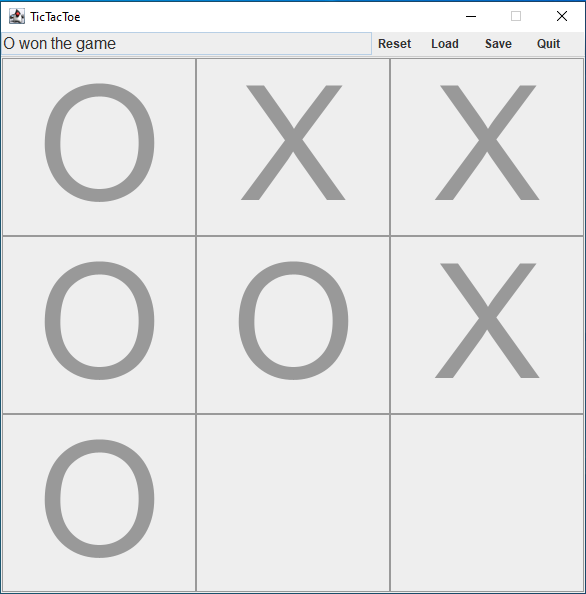
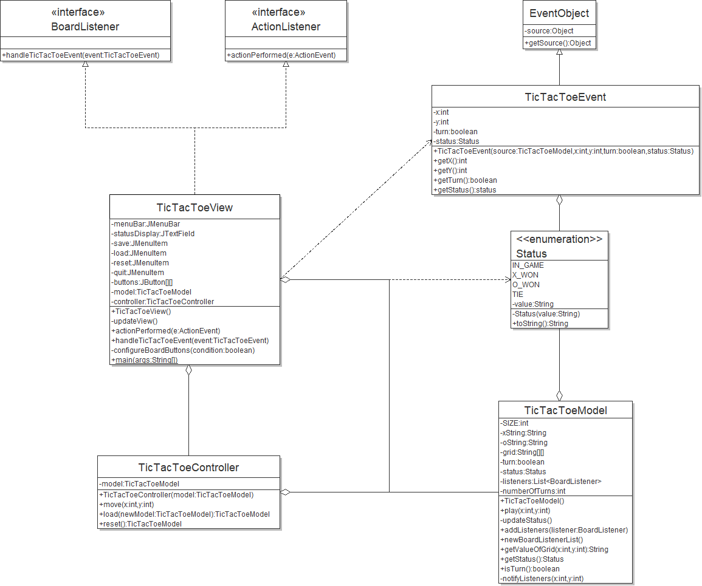

## TicTacToe Game

This GitHub repository is used for the development of a game based on TicTacToe that follows the MVC design pattern.





## Development

##### Tools

- [IntelliJ IDEA](https://www.jetbrains.com/idea/download/)
- [Java 14](https://adoptopenjdk.net/)
- [Maven](https://maven.apache.org/download.cgi)

##### Getting Started

1. From your terminal, run:
   ```
   git clone https://github.com/MohamedRadwan/TicTacToe
   ```
   This will create a folder called TicTacToe.
    
2. IntelliJ IDEA
    1. Open the IntelliJ IDEA IDE, and click File -> Open.
    2. Select the TicTacToe folder that was just created and click Open.
    
##### Additional Tools

- Contributions are to be made through GitHub, on this repository.
- GitHub issues can be opened for features or bug reporting.

## Current Class Diagram

<p style="text-align:right">

</p>
Date: June 11, 2020

## Known issues

Currently, there are no known issues.

> If you notice a bug, please add it to Issues tab. Make sure you include how to recreate the bug!
